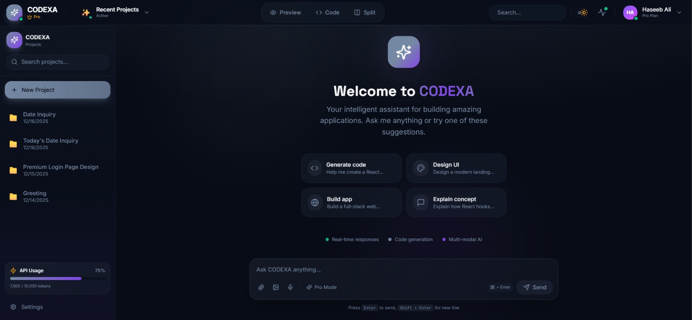
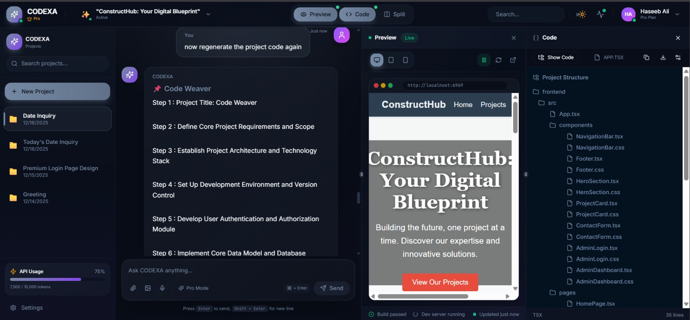

# CODEXA – AI Powered Project Generation Platform

 ---

## Overview

CODEXA is an **AI-powered project generation and conversational coding platform** designed to assist users throughout the **entire software development lifecycle** using natural language interaction.

Unlike traditional AI coding assistants that generate isolated code snippets, CODEXA operates at the **project level**, allowing users to describe their ideas in plain language and receive **structured project plans, complete source code, validated outputs, and real-time previews**. By combining a **multi-agent AI architecture**, persistent project memory, and an interactive development workspace, CODEXA bridges the gap between conceptual thinking and practical software implementation.

---

## Objectives

- Enable natural language–driven software project generation  
- Automate project planning, code generation, and debugging  
- Maintain persistent, project-wise conversational context  
- Provide a unified interface for chat, code visualization, and live preview  
- Improve accessibility, learning, and productivity for developers and students  

---

## Key Features

### 🔹 Conversational Project Generation
- Describe software ideas in natural language
- Convert user intent into structured project artifacts

### 🔹 Multi-Agent AI Architecture
CODEXA employs multiple autonomous AI agents:
- **Classifier Agent** – Determines user intent  
- **Planner Agent** – Generates structured project plans  
- **Developer Agent** – Produces complete, executable source code  
- **Debugger Agent** – Validates and improves generated code  
- **Chat Agent** – Handles conversational queries  

### 🔹 Persistent Project Memory
- Project-wise chat history  
- Stored code, plans, and agent outputs  
- Seamless continuation across sessions  

### 🔹 Interactive Development Workspace
- Chat-based interface  
- Syntax-highlighted code panel  
- Live preview panel  
- Project routing with unique workspaces  

---

## System Architecture

CODEXA follows a **modular, layered client–server architecture**.

### Architecture Layers

1. **Frontend Layer (React)**  
   - Chat interface  
   - Project sidebar  
   - Code visualization  
   - Live preview  

2. **Backend API Layer (FastAPI)**  
   - Authentication & authorization  
   - Project management  
   - AI agent orchestration  

3. **AI Agent Layer**
   - Classifier Agent  
   - Planner Agent  
   - Developer Agent  
   - Debugger Agent  
   - Chat Agent  

4. **Database Layer (MongoDB)**
   - Users  
   - Projects  
   - Chat history  
   - Generated code  

5. **External AI Services**
   - Gemini API (LLMs)

### 📐 Architecture Diagram

---

## Working Methodology

1. User logs in  
2. Starts a new project or selects an existing one  
3. Submits a natural language request  
4. Intent is classified  
5. Project pipeline or conversational response is triggered  
6. Outputs are generated and stored  
7. Results are displayed in chat, code, and preview panels  

---

## Proposed Algorithm

**Context-Aware Multi-Agent Project Generation Algorithm**

- Intent classification  
- Automated planning and execution  
- Context preservation  
- Modular agent orchestration  

---

## Results & Evaluation

The system demonstrates:
- Reduced development complexity  
- Faster project prototyping  
- Improved architectural understanding  
- Enhanced learning outcomes  
- Reliable AI-generated outputs  

---

## Technologies Used

### Frontend
- React (TypeScript)
- Modern UI components

### Backend
- FastAPI
- RESTful APIs
- JWT Authentication

### AI
- Gemini API
- Multi-agent architecture

### Database
- MongoDB

---

## Screenshots

  
  

---

## Applications

- Academic projects  
- Rapid prototyping  
- AI-assisted development  
- Software engineering education  
- Research in autonomous systems  

---

## Future Enhancements

- Multi-language support  
- Collaborative development  
- GitHub & CI/CD integration  
- Automated testing  
- Voice-based interaction  
- Explainable AI  

---

## Authors

- **Mohammed Furqan Siddiq**
- **Muhammad Afzal** 
- **Mohammed Haseeb Ali** 
  
---

## 📄 License

This project is developed for **academic and educational purposes** as part of the Bachelor of Engineering (CSE) curriculum.
